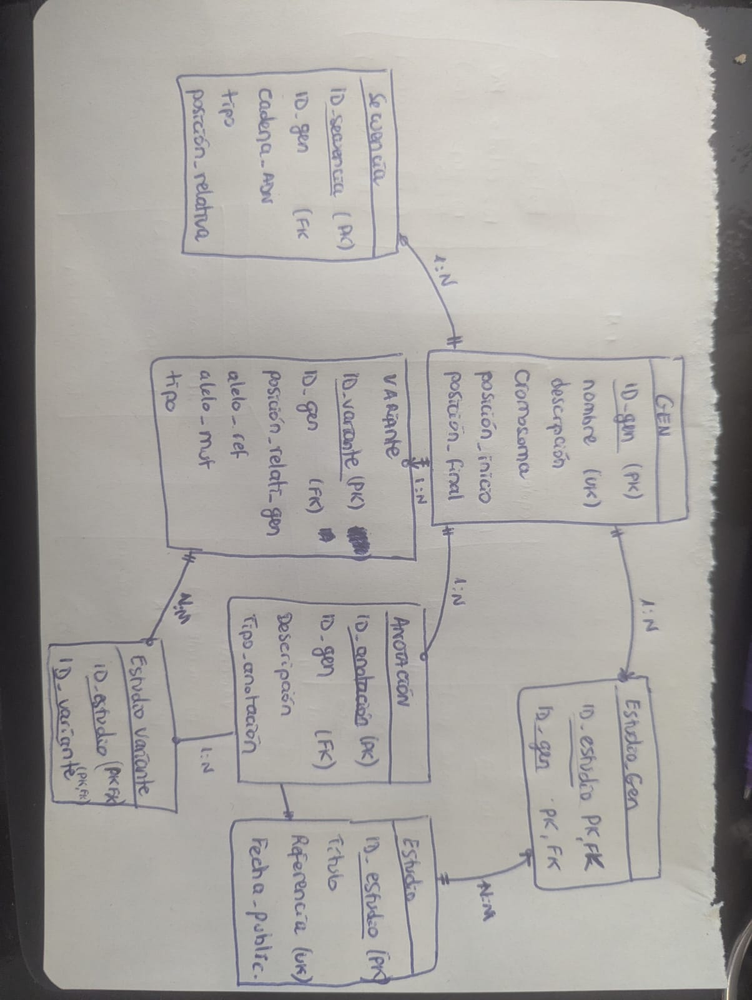

Análisis de requeriientos: 
Entidades
Entidades principales identificadas son:

•	Gen: unidad principal de información genética. 
•	Secuencia: Fragmentos de ADN que están asociada a un gen. 
•	Variante: cambios genéticos presentes. 
•	Anotación: información adicional que se relaciona con la función del gen.
•	Estudio: investigaciones científicas que se han hecho sobre genes o variantes. 

Relaciones
Las relaciones entre entidades:

•	Un gen puede tener una o varias secuencias. 
•	Un gen puede tener una o varias variantes. 
•	Un gen puede tener una o varias anotaciones. 
•	Un estudio puede estar relacionado con uno o varios genes. 
•	Un estudio puede estar relacionado con una o varias variantes. 
•	Un gen puede aparecer en varios estudios. 
•	Una variante puede aparecer en varios estudios. 

Restricciones:

•	La representación de ADN de una secuencia debe tener entre 10 y 1000 caracteres. 
•	El nombre del gen es obligatorio. 
•	La descripción del gen es obligatoria. 
•	La posición relativa de secuencias y variantes debe ser un número entero mayor que 0. 
•	La referencia de un estudio debe seguir el formato AAAA/111 (cuatro letras y tres números). 
•	Los alelos tendrán como valor por defecto el símbolo “-”.

Utilice estas relaciones:

